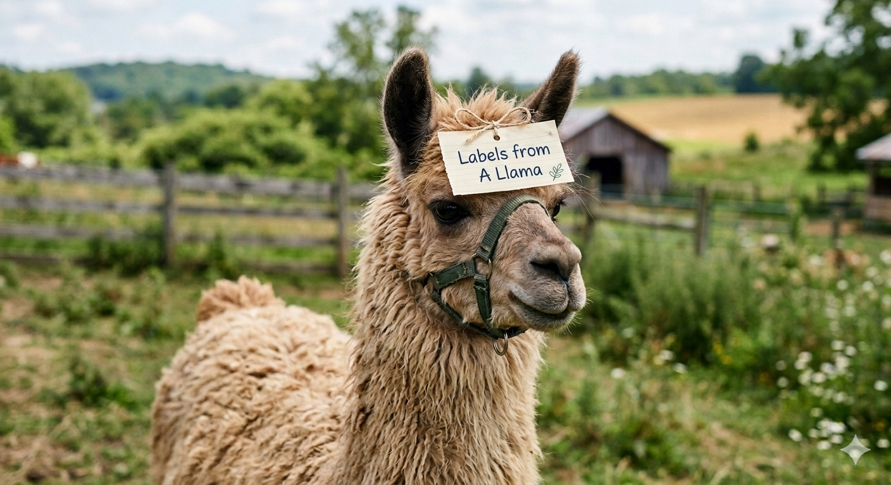

# llama Labels

llama Labels is a Dockerized Proton Mail auto-labeler.

It polls unread inbox mail, classifies each message with an internal Ollama model (`qwen3:1.7b` by default), and applies matching Proton labels.

## Overview

Runtime is a single container managed by `supervisord`, running:

- API server (`llama-lab --mode server`)
- Polling daemon (`llama-lab --mode daemon`)
- Internal Ollama service (`ollama serve`)
- One-shot model pull worker (`ollama pull qwen3:1.7b`)

Classification flow:

1. Fetch unread inbox messages from Proton.
2. Redact configured sensitive content.
3. Build a prompt from sender/subject/body plus tuning context.
4. Send prompt to Ollama (`/api/generate`).
5. Match model output against allowed labels.
6. Apply the label in Proton.
7. Persist checkpoint and decisions to avoid unnecessary reprocessing.

## Requirements

- Docker
- Docker Compose

Optional (local development outside Docker):

- Go 1.26+
- Node.js 20+
- npm

## Quick Start

1. Clone the repository.

2. (Optional) copy env defaults:

```bash
cp .env.example .env
```

3. Generate Proton Mail storage-state auth file:

```bash
node scripts/generate_mail_auth.js
```

This creates `scripts/mail_auth.json`.

4. Build and run:

```bash
docker compose up --build -d
```

5. Open UI:

- http://localhost:5866

6. Login with bootstrap account:

- Username: `admin`
- Password: `ChangeMeNow123!`

Password change is required on first login.

7. In **Config**, upload Proton auth (`mail_auth.json`).

8. In **Tuning**, sync/build labels and save `TUNING.md`.

## Environment Variables

Primary variables:

- `OLLAMA_BASE_URL` (default `http://127.0.0.1:11434`)
- `OLLAMA_MODEL` (default `qwen3:1.7b`)
- `PROTON_AUTH_FILE` (default `/llama_lab/config/proton-auth.json`)
- `PROTON_API_HOST` (optional override)
- `TUNING_FILE` (default `/llama_lab/config/TUNING.md`)
- `TZ` (default `America/New_York`)

Notes:

- The image sets `OLLAMA_MODELS=/llama_lab/state/ollama/models` so model cache persists in volume state.
- Ollama API can be exposed by uncommenting `11434:11434` in `docker-compose.yml`.

## Data and Volumes

Named volumes map to:

- `/llama_lab/config`
- `/llama_lab/logs`
- `/llama_lab/state`

Important files:

- `/llama_lab/config/config.yaml`
- `/llama_lab/config/admin.env`
- `/llama_lab/config/proton-auth.json`
- `/llama_lab/config/TUNING.md`
- `/llama_lab/state/state.json`
- `/llama_lab/state/decisions.json`
- `/llama_lab/state/ollama/models/*`

## UI Pages

- Login
- Config
- Tuning
- Labels
- Decisions
- Logs
- Health
- Status

## API Endpoints (high-use)

Auth/session:

- `POST /api/auth/login`
- `GET /api/auth/me`
- `POST /api/auth/logout`
- `POST /api/auth/password`

Runtime/status:

- `GET /api/status`
- `GET /api/health`
- `POST /api/health/repair`

Config/data:

- `GET|PUT /api/config`
- `GET /api/labels`
- `GET /api/decisions`
- `GET|PUT /api/tuning`

Logs:

- `GET /api/logs?file=<name>.log&lines=<n>`
- `GET /api/logs/list`

Auth uploads/tests:

- `GET|POST /api/proton/auth`
- `POST /api/llama/test`

## Build and Dev Checks

Backend:

```bash
cd backend
go build ./...
```

Frontend:

```bash
cd frontend
npm install
npm run build
```

## Logging

Main logs:

- `app.log` - API/app-level events
- `daemon.log` - poller lifecycle and tick summaries
- `llama.log` - model/runtime activity and output lines
- `llama.err.log` - model/runtime error lines
- `llama-server.log` - classify/warmup trace lines

Log UI reads from `/api/logs` and `/api/logs/list`.

## Operational Notes

- Poller tick timeout is long enough for large inbox sweeps.
- Classify calls are serialized and paced to reduce model busy/flaky responses.
- AI-credits exhaustion is tracked as a sticky health/state flag and auto-clears on successful classify.
- Proton token upload converts storage-state cookies into API token + cookie material and restarts daemon process.

## Troubleshooting

### Ollama/model issues

- Check logs:

```bash
docker compose logs -f llama-lab
```

- Verify model pull happened (`qwen3:1.7b`).
- If needed, restart services:

```bash
docker compose restart
```

### Proton auth issues

- Re-upload fresh `mail_auth.json` via Config.
- Confirm `/llama_lab/config/proton-auth.json` exists and is parseable.
- Check `daemon.log` and `app.log` for 401/422 refresh errors.

### No labels applied

- Confirm labels exist in Proton and are present in allowlist/tuning.
- Confirm unread inbox has eligible messages.
- Check Decisions page and `daemon.log` tick summary counts.

## Project Structure

- `backend/` - Go API server, poller, adapters, state/health
- `frontend/` - React + Vite UI
- `scripts/` - runtime/bootstrap helpers
- `Dockerfile` - single image (backend, frontend, Ollama runtime)
- `docker-compose.yml` - local orchestration
- `supervisord.conf` - in-container process supervision
